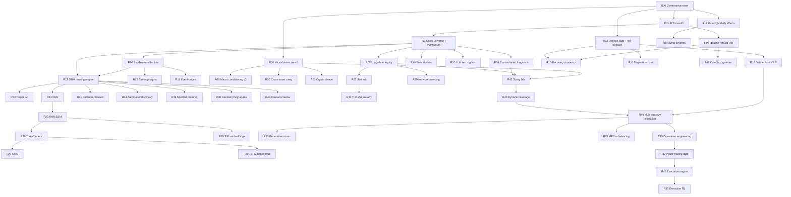

# Atlas Offensive — Run Dependency Graph

Machine-readable edge list plus a Mermaid rendering. Run definitions live in
`atlas_offensive_future_run_registry.csv`.

## Classification

| Class | Runs |
|---|---|
| Foundation | R00, R01 |
| Core alpha | R02, R03, R04, R05, R06, R08 |
| Adjacent alpha | R07, R09, R10, R11, R12, R17, R18, R19, R21 |
| Derivatives | R13, R14, R15, R16 |
| Frontier ML | R22–R31, R34 |
| Moonshot mathematics | R35–R41 |
| Execution | R32, R46 |
| Risk engineering | R33, R45 |
| Integration | R42, R43, R44, R47 |

## Critical path

R00 → R01 → R03 → R05 → R22 → R42 → R44 → R45 → R47

(Governance → data → breadth → shorting → ML ranking → sizing → multi-strategy
→ drawdown engineering → paper trading.)

## Parallel tracks after R03

- Equity track: R04, R05, R06 → R07, R12, R19, R22+
- Futures/macro track: R08 → R09, R10, R21 (independent of equity track)
- Options track: R13 → R14, R15, R16 (independent; needs only R00 + data)
- Short-horizon track: R17 → R18 (needs intraday infra, G06)

## Edge list (dependency → dependent)

```
R00 -> R01, R08, R13, R17
R01 -> R02, R03
R02 -> R15, R41
R03 -> R04, R05, R06, R19, R20, R22
R05 -> R07, R39
R06 -> R11, R12, R22
R07 -> R37
R08 -> R09, R10, R21
R13 -> R14, R15, R16
R17 -> R18
R22 -> R23, R24, R31, R34, R36, R38, R40
R24 -> R25
R25 -> R26, R28
R26 -> R27, R29
R01 + R09 + R13 -> R30
R42 <- (any 3 alpha runs complete)
R42 -> R43
R44 <- (3+ engines in paper)
R44 -> R33, R35, R45
R45 -> R47
R46 <- (paper trading live) ; R46 -> R32
```

## Mermaid


